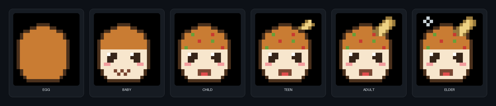

# OpenTama 🥚



> **出社促進キット.** A Tamagotchi-style virtual pet that grows **only**
> while you're connected to the office WiFi. Ships as a Claude Code
> skill, talks to other OpenTamas over USB IR, and lives inside a retro
> ガラケー frame.

| | |
|--|--|
| status | beta — 304 tests, three OS targets in CI |
| python | 3.11 + (uses stdlib `tomllib`) |
| license | MIT |
| size | < 30 KB of source; zero runtime dependencies (pyserial optional for IR hardware) |

---

## What it is

OpenTama is a small terminal pet — a takoyaki mascot named **Takoron
(タコロン)**, complete with bonito flake on top — that:

- **Grows** while your WiFi SSID matches the configured office SSID.
- **Decays** when you're away — happiness 4× faster than at the office.
- **Renders as a pixel sprite** inside one of three retro feature-phone
  frames (monochrome 90s candybar / mid-2000s color flip / late-era
  widescreen ガラケー). Drawn with Unicode half-blocks (`▀ ▄ █`) so it
  could plausibly run on a real ガラケー LCD.
- **Talks to other OpenTamas** over a USB-attached IR adapter using a
  small framed protocol with CRC16-CCITT.
- **Is extensible** via a sandboxed plugin system: capabilities, SHA-256
  integrity, and a trust-on-first-use store.

> Takoron is an original mascot character — see
> [CHARACTER.md](CHARACTER.md) for the credit and notes on swapping in
> your own pet.

It's also a [Claude Code](https://docs.claude.com/en/docs/claude-code/overview)
skill — drop the folder into `~/.claude/skills/` and Claude will use the
pet whenever you mention OpenTama, your office pet, your たまごっち, or
出社. See [INSTALL.md](INSTALL.md) for the full Claude Code wiring guide.

## Install

For yourself:

```bash
pip install opentama                  # once published to your index
# or, from a checkout
pip install -e ".[dev]"
```

For internal company distribution, the typical setup is:

```bash
# 1) Maintainer publishes to the company package index.
python -m build && twine upload --repository internal dist/*

# 2) Everyone else installs from there.
pipx install --index-url https://pypi.internal.example.com/simple opentama
```

For IR hardware support:

```bash
pip install "opentama[ir]"            # adds pyserial
```

## Quick start

```bash
# Hatch (one-time).
opentama init たまお YourOfficeSSID

# See the pet inside a retro frame.
opentama status --display iro

# Care.
opentama feed
opentama play
opentama sleep

# Talk to a teammate's pet over a USB IR adapter.
opentama ir greet --port serial:///dev/ttyUSB0
```

`opentama --help` lists everything. Detailed CLI docs:
[docs/CLI.md](docs/CLI.md) (if present in your fork — same content as in
[SKILL.md](SKILL.md)).

## What it looks like

```
  +----------------------------+
  | .                       () |
  +----------------------------+
  | :D タコロン adult 520gp    |
  |                            |
  |               ▄██▄         |
  |            ▄▄██▄██▄        |
  |         ▄▄██▀███▀███       |
  |         ███████▄████       |
  |         ██▀ ████ ▀██       |
  |         ██▄██████▄██       |
  |         ████▄▄ ▄████▄      |
  |          ▀████████▀        |
  |                            |
  | happy   #########...  80   |
  | hungry  #########...  80   |
  | energy  #########...  80   |
  +----------------------------+
  |  feed  play  sleep  ir  cfg|
  +----------------------------+
  |  [ < ]  [ OK ]   [ > ]     |
  +----------------------------+
```

かつおぶしの飾り、上半分にトッピングの点々、^_^ の閉じ目、
両ほっぺのチーク、開いた口からペロッと舌が見えます。

### Takoron in colour

On a truecolor terminal `opentama show` renders Takoron in full colour —
browned dough, green nori, red pickled ginger, a pale bonito flake, and a
cream face with pink cheeks. The same per-pixel art is the project's
official illustration of the pet across all six life stages.

The cover image above ([docs/takoron_cover.png](docs/takoron_cover.png)) and
the interactive [docs/takoron_preview.html](docs/takoron_preview.html) both
show every stage (たまご → ご長老) side by side. Both are generated straight
from the art source, so they never drift from what the app draws:

```bash
python scripts/make_cover.py     # regenerates docs/takoron_cover.png  (Pillow)
python scripts/make_preview.py   # regenerates docs/takoron_preview.html
```

The colour grid lives in [`opentama/art.py`](opentama/art.py) (a per-pixel
`PALETTE` + `GRIDS`); the compact monochrome bitmaps the ガラケー frames use
stay in `opentama/sprites.py`.

## Sharing the pet inside your company

There are three good ways:

1. **As a Python package on your internal index.** Anyone runs
   `pipx install opentama` and they're done. Each colleague has their
   own pet but the binary is centrally maintained.

2. **As a Claude Code skill in a project repo.** Drop OpenTama into
   `.claude/skills/opentama/` inside a shared project, commit it, and
   every contributor's Claude Code session will use the pet
   automatically. See [INSTALL.md](INSTALL.md).

3. **As a personal dotfile.** Symlink your clone to
   `~/.claude/skills/opentama/`. Each person manages their own checkout.

Pets stay personal because state lives in `~/.opentama/state.json`,
which is *not* in the repo (see `.gitignore`).

## Files

```
opentama/
├── core.py            # the Tamagotchi class (DI: ssid_provider, clock)
├── state.py           # JSON-backed TamaState
├── stages.py          # life stages
├── sprites.py         # mono pixel-art bitmaps + half-block renderer
├── art.py             # full-colour per-pixel portrait (PALETTE + GRIDS)
├── wifi.py            # cross-platform SSID detection
├── cli.py             # argparse CLI (opentama / python -m opentama)
├── ir/
│   ├── protocol.py    # frames + CRC16-CCITT-FALSE + parse_stream
│   ├── transport.py   # SerialIRTransport, LoopbackIRTransport
│   └── session.py     # greet / gift / visit
├── plugins/
│   ├── api.py         # Capability, PluginContext, Plugin base classes
│   └── loader.py      # manifest, integrity, TrustStore, PluginLoader
└── displays/
    ├── _layout.py     # visual-width-aware padding
    ├── monokuro.py    # mono early-90s candybar
    ├── iro.py         # color mid-2000s flip
    └── wide.py        # late-era widescreen ガラケー
```

Plus `scripts/make_cover.py` + `scripts/make_preview.py` (regenerate the
colour cover image and HTML preview), `docs/takoron_cover.png` and
`docs/takoron_preview.html` (the generated illustrations),
`examples/plugins/` with two reference plugins (`stats_card`, `ir_ping`),
and `tests/` with 304 tests.

## Tests

```bash
pip install -e ".[dev]"
pytest
```

The suite covers WiFi detection (mocked subprocess), state persistence,
growth/decay over time, the CLI, the IR wire protocol (CRC vectors,
round-trips with Japanese payloads, every error class, resync on
garbage), IR transports (loopback + fake serial), high-level IR
sessions (concurrent loopback), plugin manifest parsing, SHA-256
integrity (positive + tamper), trust store semantics, capability
gating, the pixel sprite renderer, and rendered output for each
display.

CI runs on Ubuntu / macOS / Windows × Python 3.11 / 3.12 / 3.13.

## Contributing

See [CONTRIBUTING.md](CONTRIBUTING.md). TL;DR: keep it small, keep it
honest, add a test.

## License

The **software** is MIT — see [LICENSE](LICENSE).

The bundled **Takoron character art** (`opentama/sprites.py` and
`opentama/art.py`) is an original mascot by the project maintainer and is
governed by
[CHARACTER.md](CHARACTER.md), which spells out what is and isn't
granted. In short:

- Using OpenTama as-is, internally or as an unchanged public fork, is
  fine — keep `CHARACTER.md` in place.
- Any other use of the Takoron name or likeness (merchandising, the
  LINE sticker artwork, derivative character art) needs separate
  permission.
- A fork that replaces the sprites with your own pet is a one-file
  diff — see CHARACTER.md.

The split is also summarised in the top-level [NOTICE](NOTICE) file.
